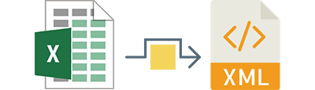

# Python xls2xml converter



This project contains a Python code for converting all Excell files (xlsx, xlsm, xltx, xltm) to pretified XML format. 

### Dependencies:
This script uses openpyxl library for maniuplating files. For simplicity I included instalation files for Python 2.5 which you can download and simply run setup.py to install it. This has been tested on MacOS Sierra and High Sierra. <br>


<b> <small> There's a high chance it will not work on Windows since I didn't have time to test it. In that case, visit the openpyxl repo and follow install instructions for Windows or Linux machines before you continue. </small> </b> 

### Usage:

The script is amazingly simple to use simply run the index.py file.

```python
python index.py	
```

### How it works? 
The script will scan for all the supported files within its root folder and convert them all. XML files will be saved into a folder named XML which the script also creates. Every row within excell will be saved as a separete XML (one row for header and one for content). XML will be saved as a pritified output (you can modify the script if you need compressed). Script works for any number of sheets, number of columns and rows. The format of the XML will have look like the following: 

```xml

<?xml version='1.0' encoding='utf-8'?>
<Workbook>
  <Worksheet name="Sheet name">
    <Row>
      <Cell>
        <Data type="String">Column one</Data>
      </Cell>
      <Cell>
        <Data type="String">Column two</Data>
      </Cell>
    </Row>
    <Row>
      <Cell>
        <Data type="unicode"> Content as a string </Data>
      </Cell>
      <Cell>
        <Data type="long"> 12345 </Data>
      </Cell>
    </Row>
  </Worksheet>
</Workbook>

```
The name of each XML file will have the following format: <b> 2017-12-12_17.40.23.545001 </b>
and is guaranted to be unique for every export. 

### Feature list breakdown:

 * Scans for all supported files 
 * Converts regardles of the number of sheets, rows or columns 
 * Exports uniqe XML file for every row 
 * Provides data type for every cell 


### Planed future features and improvements:   

 * Create a config file for allowing users to customize script behaviour  
 * Support CSV files  
 * Make compresed version to be used as a standalone cross platform app 


### Contributions:

Any improvements to the script, bug fixes or feature additions are more than welcome. Fork the code, and submit a pull request, I will do my best to review it in shortest possible time. You can also open an issue if you have any questions or problems. 

